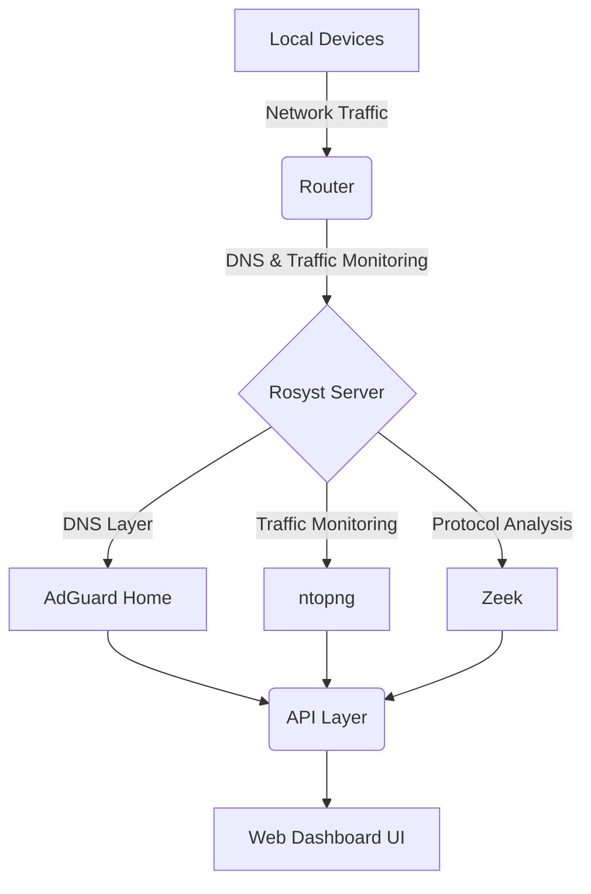

#  Rosyst

  
  
  
  

**A unified network intelligence platform designed to give you complete visibility and control over your local home or office network.**

---

## 🎯 Objective
To build a system that provides:
- **Per-Device Visibility:** Know exactly what every device on your network is doing.
- **Domain-Level Monitoring:** Track DNS queries and connections in real-time.
- **Bandwidth Usage:** Monitor incoming and outgoing traffic accurately.
- **Instant Control:** Block specific domains or devices with a single click.

---

## 🏗️ Architecture
Rosyst acts as the central hub for your network's traffic by taking over DNS responsibilities and passively monitoring bandwidth.

---

## 🛠️ Tech Stack
- **Core OS:** Linux, Windows (via WSL), macOS, or Raspberry Pi OS
- **DNS & Ad-blocking Engine:** AdGuard Home (with dynamic `user_rules` API polling)
- **Traffic Analysis Engine:** ntopng (running with `-l 1` flag to bypass API auth restrictions)
- **Deep Packet Inspection (Optional):** Zeek
- **Backend API:** FastAPI (Python)
- **Frontend UI:** Next.js / React (Hot-reloading enabled)

---

## 🗺️ Roadmap & Implementation Phases

### Phase 1: Foundation (Infrastructure)
- [ ] Set up the host OS (Linux, Windows, macOS, or Raspberry Pi) on a dedicated Mini PC or Server.
- [ ] Assign a static IP (e.g., `192.168.1.10`).
- [ ] Configure the local router to force DHCP DNS traffic through the Rosyst server.
- [ ] Add firewall rules to redirect port 53 and block external DNS fallback (like 8.8.8.8).

### Phase 2: Core Engine (Data Collection)
- [x] **DNS Layer:** Install and configure AdGuard Home for domain visibility and query logging.
- [x] **Traffic Monitoring:** Install ntopng, bind it to the network interface, and enable local network detection.
- [ ] *(Optional)* **Deep Analysis:** Integrate Zeek for richer HTTP/SSL metadata classification.

### Phase 3: Data & API Layer
- [x] Design the core data model (Devices, Domains, Traffic).
- [x] Build a unified backend API to pull data simultaneously from the AdGuard and ntopng APIs.
- [x] Create endpoints for `/devices`, `/domains`, `/traffic`, `/stats`, and `/blocked`.
- [x] Ensure the API handles empty AdGuard block lists safely via dynamic array falling back.

### Phase 4: Product UI
- [ ] Develop a fast, clutter-free Next.js dashboard.
- [ ] **Views:** Total Traffic Overview, Device Specific Activity, Realtime Domain Requests, and Actionable Controls.
- [ ] Implement the UI -> API -> AdGuard blocking flow.

### Phase 5: Stability & Packaging
- [ ] Configure log rotation and storage policies (7-30 days retention).
- [ ] Optimize ntopng settings to reduce heavy logging overhead.
- [x] Dockerize the entire stack for simple deployment.
- [ ] Create a one-command install script (`curl install.rosyst.com | bash`).

---

## 🤝 Contributing

Contributions, issues, and feature requests are welcome! 

Since Rosyst is in active v1 development, feel free to check the [issues page](https://github.com/rokibulroni/Rosyst/issues). If you have a great idea for the project:

1. **Fork** the Project
2. **Create** your Feature Branch (`git checkout -b feature/AmazingFeature`)
3. **Commit** your Changes (`git commit -m 'Add some AmazingFeature'`)
4. **Push** to the Branch (`git push origin feature/AmazingFeature`)
5. **Open** a Pull Request

---

## 👨‍💻 Author

**Rokibul** 
- GitHub: [@rokibulroni](https://github.com/rokibulroni)

---

## 📄 License

This project is open-source and available under the [MIT License](LICENSE).

  

